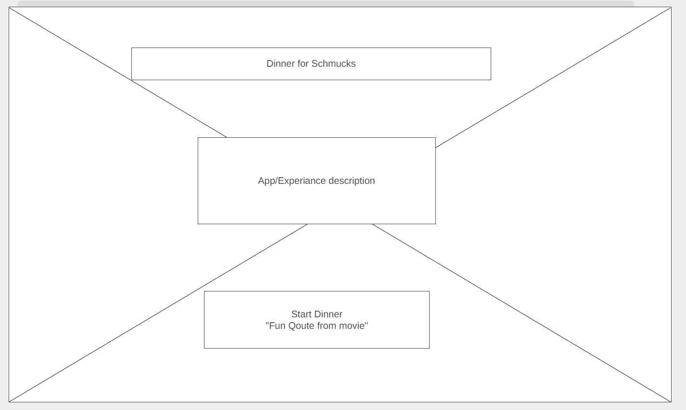
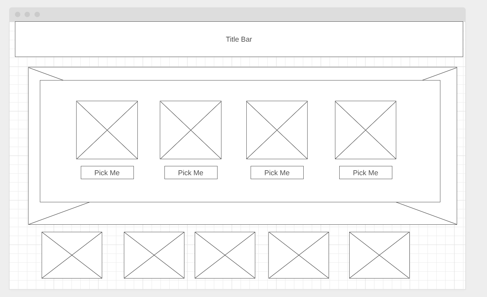
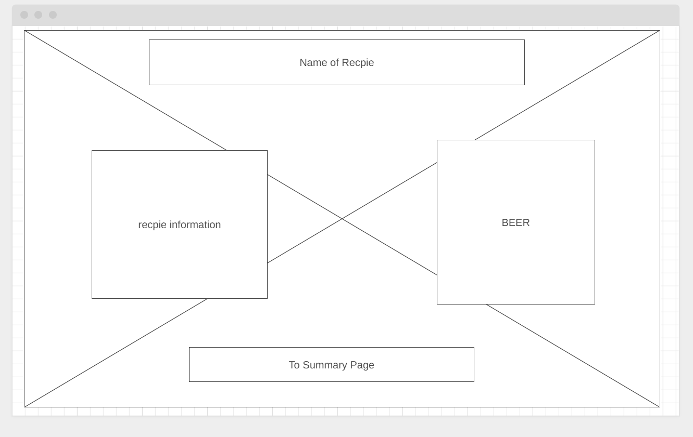
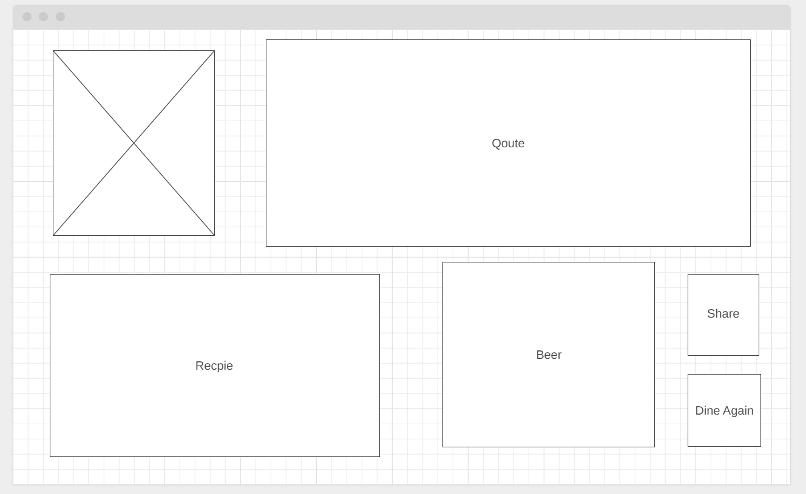

<h2 align="center">Dinner With Schmucks</h2>

---

<div align="center">

<h5 align="center">


🎯 Project 1 🎯<br>
(WW23.1) / June 6th 2022<br>
Version 0.1</h5>
</div>

---


<br>
<br>
<br>
<br>

<h3 align="center">📡 📡 Deployment Information 📡 📡</h3>

---

<div align="center">
🚀 <a href="https://github.com/DesertCow/DinnerWithSchmucks">https://github.com/DesertCow/DinnerWithSchmucks</a> 🚀
<br>
<br>
🛰️ <a href="https://desertcow.github.io/DinnerWithSchmucks">https://desertcow.github.io/DinnerWithSchmucks</a> 🛰️
</div>

<br>
<br>
<br>
<br>

<h3 align="center">📢 📢 Elevator Pitch 📢 📢</h3>

----
<p align="center">"Have your ever wanted to have dinner with your favorite character from movies and television? With our app you can have a once in a life time experience. Our App provides you with a recipe for dinner, a beer to go with it, and a memorable quote from your favorite character." </p>


<br>
<br>
<br>
<br>

<h3 align="center">📐 📐 Wireframe 📐 📐</h3>

----
<p align="center">
  
<h5 align="center">Home Page Wireframe <br>(index.html)</h5>
<br>
<br>

<p align="center">
  
<h5 align="center">Characters Selection Wireframe <br>(characters.html)</h5>

<br>
<br>

<p align="center">
  
<h5 align="center">Recpie/Beer Page Wireframe <br>(dinner.html)</h5>

<br>
<br>

<p align="center">
  
<h5 align="center">Summary Page w/Character Qoute <br>(summary.html)</h5>


<br>
<br>

<h3 align="center">🚇 🚇 API Information 🚇 🚇</h3>

----


#### Chuck Norris API

- Website: <https://api.chucknorris.io/>
- API Link: <https://api.chucknorris.io/jokes/>
- Format: ````JSON / GET````
- Notes: 

  ##### API Calls

  - ````https://api.chucknorris.io/jokes/random?category={category}````
  - ````https://api.chucknorris.io/jokes/categories````
  - ````https://api.chucknorris.io/jokes/search?query={query}````
<br>
<br>

#### Ron Swanson API

- Website: <https://github.com/jamesseanwright/ron-swanson-quotes>
- API Link: <https://ron-swanson-quotes.herokuapp.com/v2/quotes>
- Format: ````JSON / GET````
- Notes: 
  - The ````Access-Control-Allow-Origin```` header is set to ````*```` so that you can make requests from any domain.

##### API Calls

  - ````https://ron-swanson-quotes.herokuapp.com/v2/quotes````
  - ````https://ron-swanson-quotes.herokuapp.com/v2/quotes/<count>````
  - ````https://ron-swanson-quotes.herokuapp.com/v2/quotes/search/<term>````

<br>
<br>
<br>
<br>

<h3 align="center">🖼️ 🖼️ CSS Information 🖼️ 🖼️</h3>

----

#### Metro 4 

- Website: <https://metroui.org.ua/>
- Source Status: open-source
- License: **The MIT License**
- Version: **4.0**
- Documentation: <https://metroui.org.ua/m4q-about.html>
- Project Integration: 
    **- HTML :** ````
          "<link rel="stylesheet" href="https://cdn.metroui.org.ua/v4/css/metro-all.min.css">
          ````
  
    **- JS &nbsp;&nbsp;&nbsp;&nbsp;&nbsp;&nbsp;:**````
        <script src="https://cdn.metroui.org.ua/v4/js/metro.min.js"></script>
      ````

#### CSS RESET

- Website: <https://meyerweb.com/eric/tools/css/reset/>
- Version: **2.0** [1-26-2011]
- License: **none** (public domain)
          

<script src="https://cdn.metroui.org.ua/v4/js/metro.min.js"></script>

<br>
<br>
<br>
<br>

<h3 align="center">👨‍💻 👨‍💻 Development Team 👨‍💻 👨‍💻</h3>

----

<br>

- Dante Stargiotti
- Parin Thalangdee
- Eric Nguyen
- Clayton Skaggs
<br>
<br>
<br>

<h3 align="center">⌛ ⌛ Project Timeline ⌛ ⌛</h3>

----

<br>

- Version 0.5 HTML: **May 31st**
- Final Version Deadline: **June 6th**


